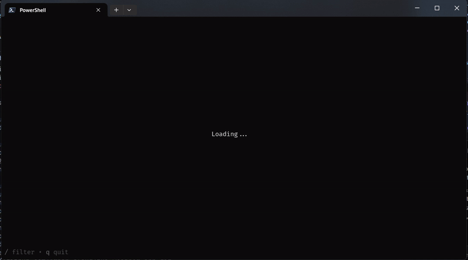

# TUI Weather App 🌦️

A simple terminal-based weather application written in **Go**, built using **Bubble Tea** framework.

The app fetches weather data from a public weather API and displays it in an interactive terminal UI. It also includes features like fuzzy finding for cities and caching of weather data for quicker access.

---

## Features

- Terminal UI (TUI) powered by Bubble Tea
- Displays current weather information
- Fuzzy finding for city search
- Caching of weather data
- Keyboard-driven interaction
- Cross-platform (Windows, macOS, Linux)
- Single static binary (no runtime dependencies)

---

## Demo



---

## Installation & Usage

You can run the app in **two ways**:
1. Using a **prebuilt binary** (recommended for users)
2. Running it **from source** (for developers)

### Setting up the Weather API Key

Before running the application, you'll need to obtain an API key from a weather service.
1. Sign up for a free API key from a service like [OpenWeatherMap](https://openweathermap.org/api) or similar.
2. Create a file named `.env` in the root directory of the application (or in the user's application data directory, which is `C:\Users\<username>\AppData\Local\tui_weather_app` on Windows, `~/Library/Application Support/tui_weather_app` on macOS, or `~/.local/share/tui_weather_app` on Linux).
3. Add your API key to this `.env` file in the following format:

    ```/dev/null/example.env#L1-1
    API_KEY=YOUR_API_KEY_HERE
    ```
    Replace `YOUR_API_KEY_HERE` with the actual API key you obtained.

### Database for Caching

The application uses an SQLite database for caching weather data. The database file (`weather.db`) will be automatically created in the user's application data directory (the same location as the `.env` file mentioned above) when the application is run for the first time. No manual setup is required.

---

## Option 1: Run using prebuilt binaries (GitHub Releases)

This is the recommended way to use the TUI Weather App.

### 1. Download the binary
Go to the **Releases** page on GitHub and download the pre-compiled binary for your operating system (e.g., `tui_weather_app_windows_amd64.exe` for Windows, `tui_weather_app_darwin_amd64` for macOS, `tui_weather_app_linux_amd64` for Linux).

### 2. Make it executable (macOS/Linux only)
On macOS and Linux, you might need to give execute permissions to the downloaded binary:

    ```/dev/null/bash#L1-1
    chmod +x tui_weather_app_darwin_amd64
    ```
    (Replace `tui_weather_app_darwin_amd64` with the actual filename.)

### 3. Run the application
Execute the binary from your terminal:

    ```/dev/null/bash#L1-1
    ./tui_weather_app_darwin_amd64
    ```
    On Windows, you can simply double-click the `.exe` file or run it from Command Prompt/PowerShell:

    ```/dev/null/cmd#L1-1
    .\\tui_weather_app_windows_amd64.exe
    ```

---

## Option 2: Run from source (for development)

This method requires you to have [Go](https://golang.org/doc/install) installed on your system.

### 1. Clone the repository
First, clone the project repository to your local machine:

    ```/dev/null/bash#L1-1
    git clone https://github.com/Arnab-cloud/tui_weather_app.git
    cd tui_weather_app
    ```

### 2. Set up the API Key
Follow the "Setting up the Weather API Key" instructions above to create your `.env` file in the project root.

### 3. Run the application
You can run the application directly using the `go run` command:

    ```/dev/null/bash#L1-1
    go run main.go
    ```

### 4. Build the application (Optional)
If you want to build your own binary, you can use the `go build` command:

    ```/dev/null/bash#L1-1
    go build -o tui_weather_app
    ```
    This will create an executable file named `tui_weather_app` (or `tui_weather_app.exe` on Windows) in your current directory. You can then run it like a prebuilt binary:

    ```/dev/null/bash#L1-1
    ./tui_weather_app
    ```

---

## Development

### Dependencies
The project relies on the following Go modules:
- `github.com/charmbracelet/bubbletea` for the TUI
- `github.com/joho/godotenv` for environment variable loading
- `modernc.org/sqlite` for SQLite database interaction

These dependencies will be automatically handled by Go modules when you run `go run` or `go build`.

### Project Structure
- `main.go`: The entry point of the application.
- `internal/ui`: Contains the Bubble Tea UI components and logic.
- `internal/weather`: Handles interaction with the weather API and caching logic.

---

## Version Information

To check the version of the installed application:

    ```/dev/null/bash#L1-1
    ./tui_weather_app --version
    ```
    (Replace `./tui_weather_app` with the path to your executable if it's not in the current directory).
